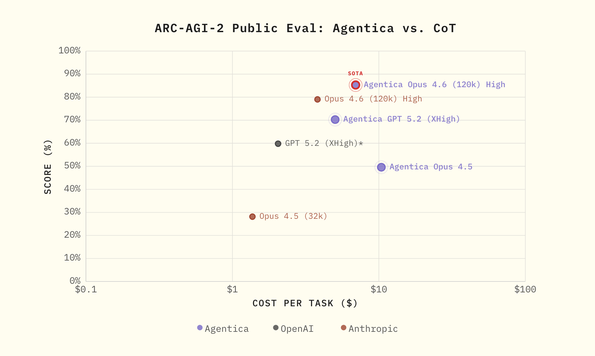

<div align="center">

# ARCgentica

[](https://github.com/symbolica-ai/arcgentica/actions/workflows/ci.yml)
[](LICENSE)
[](https://www.python.org/downloads/)
[](https://discord.gg/bddGs8bb)
[](https://x.com/symbolica)
[](https://arcprize.org/)

*Agentica achieves **85.28%** on ARC-AGI-2 with Opus 4.6 (120k) High at $6.94/task*



An agentic AI system for solving [ARC-AGI](https://arcprize.org/) challenges using LLMs. Sub-agents analyze input-output grid examples, write Python programs, and evaluate them against test inputs.

[Blog Post](https://www.symbolica.ai/blog/agentica-vs-arc-agi) | [Agentica Python SDK](https://github.com/symbolica-ai/agentica-python-sdk) | [Agentica Server](https://github.com/symbolica-ai/agentica-server) | [ARC Prize](https://arcprize.org/)

</div>

---

**[Quick Start](#quick-start)** | **[Server Configuration](#server-configuration)** | **[Options](#options)** | **[Output](#output)** | **[Analyzing Results](#analyzing-results)**

---

## Peruse the logs 

Check out the **exact logs of our agent** from the 85.28% score with Opus 4.6 in `/output/2025/anthropic/claude-opus-4-6/final/logs`!

You can re-score the candidate programs by running `uv run summary.py output/2025/anthropic/claude-opus-4-6/final`.

## Prerequisites

- **Python 3.12.11**
- **[uv](https://docs.astral.sh/uv/)** package manager
- An API key for your model provider ([OpenAI](https://platform.openai.com/), [Anthropic](https://console.anthropic.com/), or [OpenRouter](https://openrouter.ai/))

## Quick Start

Reproduce the 85.3% result with Opus 4.6 on ARC-AGI-2:

**1. Clone and install:**

```bash
export ANTHROPIC_API_KEY=<your-key>
git clone https://github.com/symbolica-ai/arcgentica && cd arcgentica
git clone https://github.com/symbolica-ai/agentica-server
```

**2. Start the server** (in one terminal):

First install the dependencies that are used by agents:
```bash
cd agentica-server && uv sync && uv pip install numpy scikit-image scipy sympy
```

then run the server:
```bash
uv run src/application/main.py \
  --inference-token=$ANTHROPIC_API_KEY \
  --inference-endpoint https://api.anthropic.com/v1/messages \
  --sandbox-mode='no_sandbox' \
  --max-concurrent-invocations 1200
  --port 2345
```

**3. Set your environment up to connect to that local server** (in another terminal):
```bash
export S_M_BASE_URL=http://localhost:2345
```

**4. Have fun!**:

```bash
uv run python main.py --model anthropic/claude-opus-4-6
```


## Server Configuration

The server supports multiple providers. Use the appropriate key and endpoint:

| Provider | `--inference-token` | `--inference-endpoint` |
|:---|:---|:---|
| **OpenAI** | `$OPENAI_API_KEY` | `https://api.openai.com/v1/responses` |
| **Anthropic** | `$ANTHROPIC_API_KEY` | `https://api.anthropic.com/v1/messages` |
| **OpenRouter** | `$OPENROUTER_API_KEY` | `https://openrouter.ai/api/v1/responses` |

> **Note:** Set `--max-concurrent-invocations` to at least `max-concurrent * num-attempts * max-num-agents` (e.g. `60 * 2 * 10 = 1200` with defaults).

## Options

| Flag | Default | Description |
|:---|:---|:---|
| `--model` | `openai/gpt-5.2` | Model (`openai/gpt-5.2`, `anthropic/claude-opus-4-5`, `anthropic/claude-opus-4-6`) |
| `--max-num-agents` | `10` | Max sub-agents each agent can spawn |
| `--timeout` | `5` | Timeout (seconds) for running generated transform code |
| `--num-attempts` | `2` | Independent attempts per problem (only the first 2 successful are used for scoring) |
| `--reasoning-effort` | `xhigh` | Reasoning effort (`low`, `medium`, `high`, `xhigh`) |
| `--num-retries` | `3` | Retries per attempt on transient errors |
| `--challenge` | `2025` | Challenge year (`2024` or `2025`) |
| `--max-concurrent` | `60` | Max problems solved concurrently |
| `--num-problems` | all | Limit number of problems to solve |
| `--selected-problems` | all | Comma-separated problem IDs |
| `--problem-fraction` | all | Slice as two ints `start end` (e.g. `1 4` for the first quarter) |
| `--run-id` | new | Continue a previous run by ID |
| `--make-submission` | off | Generate a Kaggle submission file after the run |

### More Examples

```bash
# Run 10 problems with Opus 4.6
uv run python main.py --model anthropic/claude-opus-4-6 --num-problems 10

# Run specific problems
uv run python main.py --selected-problems "007bbfb7,00d62c1b"

# Continue a previous run
uv run python main.py --run-id 3
```

## Output

Results are written to `output/<challenge>/<model>/run_<N>/`:

```
output/2025/anthropic/claude-opus-4-6/run_1/
  config.json                          # Run configuration
  results/<problem_id>/
    attempt_0.json                     # Result for each attempt
    attempt_1.json
  logs/<problem_id>/<attempt_id>/<try_num>/
    agent-0.log                        # Initial agent log
    agent-1.log                        # Sub-agent logs
    ...
```

- `attempt_id` -- independent attempts (`0` to `num-attempts - 1`)
- `try_num` -- retries within an attempt (`0` to `num-retries - 1`)
- `agent-0` is the initial agent; `agent-1`+ are sub-agents (up to `max-num-agents`)

## Analyzing Results

```bash
uv run python summary.py output/2025/anthropic/claude-opus-4-6/run_1
```

<details>
<summary>Example output</summary>

```
Score:  102.3 / 120 (85.3%)
************** Usage / task **************
Cached input tokens: 3819432.5
Non-cached input tokens: 84.5
Cache write (5m) tokens: 0.0
Cache write (1h) tokens: 179711.6
Output tokens: 129476.5
Cost per task: $6.9442
Number of agents used: 2.6
************** Time / task **************
Min: 98.4s
Mean: 1511.9s
Median: 1154.7s
Max: 7251.8s
```

</details>

## Star History

[](https://star-history.com/#symbolica-ai/arcgentica&Date)

## License

This project is licensed under the [MIT License](LICENSE).

---

<div align="center">

Built by [Symbolica AI](https://www.symbolica.ai)

</div>
